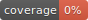

# react-boilerplate

React 16.5.2 + babel 7 + jest + webpack 4 + flow + eslint + esdoc + live editing boilerplate.

[](http://commitizen.github.io/cz-cli/)
[](https://github.com/pamepeixinho/jest-coverage-badges)
[](https://github.com/pamepeixinho/jest-coverage-badges)
[](https://github.com/pamepeixinho/jest-coverage-badges)
[](https://david-dm.org/Ziv-Barber/react-boilerplate)
[](https://david-dm.org/Ziv-Barber/react-boilerplate#info&#x3D;devDependencies)
[](https://github.com/semantic-release/semantic-release)
[](https://travis-ci.org/Ziv-Barber/react-boilerplate)


- [Getting Started](#getstart)
- [Features](#features)
- [Installation](#inst)
- [Running](#run)
- [The source code](#code)
- [Variations](#other)
- [Credit](#credit)

<a name="getstart"></a>
## Getting Started: ##

This boilerplate including a basic code to start creating a web app using React.

Start with cloning the project:

```bash
$ git clone --depth=1 git://github.com/Ziv-Barber/react-boilerplate.git your-project-name
```

- Remove the .git directory (rm -rf your-project-name/.git).
- Edit package.json and change the name of the project to your project name.

Now, create a new github project and do:
	
```bash
$ git init
$ git remote add origin https://github.com/your-name/your-project-name.git
$ git add -A
$ npm run commit
$ git push origin master
```

This project is using [semantic-release](https://github.com/semantic-release/semantic-release) to automatic handling of the version of your web app. To be able to automatic release a new version you must configure Travis-CI to your new project:

- Go to [https://travis-ci.org/](https://travis-ci.org/) and either signup or signin.
- Select your new project and click setting.
- You MUST configure a token or [semantic-release](https://github.com/semantic-release/semantic-release) will not be able to commit changes:
  - Create a new token (see [here](https://help.github.com/articles/creating-a-personal-access-token-for-the-command-line/) how to do it).
  - Permissions needed in the github token:
    - repo:
      - repo:status
      - repo_deployment
      - public_repo
    - admin:org:
      - read:org
    - admin:repo_hook:
      - write:repo_hook
    - user:
      - user:email
  - In your Travis-CI project setting, go to the environment settings section and add a new environment variable with the name 'GH_TOKEN' and the generated token as the data.
- To test everything just push something into github and it should update everything automatic!

<a name="features"></a>
## Features: ##

This project is using the following awesome libraries/utilities/services:

- [jest](https://jestjs.io/)
- [babel 7](https://babeljs.io/)
- [commitizen](http://commitizen.github.io/cz-cli)
- [esdoc](https://esdoc.org/)
- [eslint](https://eslint.org/)
- [flow](https://flow.org/)
- [better-npm-run](https://github.com/benoror/better-npm-run)
- [npm-run-all](https://github.com/mysticatea/npm-run-all)
- [react](https://reactjs.org/)
- [redux](https://redux.js.org/)
- [semantic-release](https://github.com/semantic-release/semantic-release)
- [redux-thunk](https://github.com/reduxjs/redux-thunk)
- [webpack](https://webpack.js.org/)

<a name="inst"></a>
## Installation: ##

via Git:

```bash
$ git clone git://github.com/Ziv-Barber/react-boilerplate.git
```

<a name="code"></a>
## The source code: ##

- src - all the sources.
  - types - put here all the flow type declarations.
- __tests__ - all the tests.
- webpack.config.js - the configuration for webpack.
- .editorconfig - coding style for this project.

### Scripts: ###

- start
- build
- clean
- test
- flow
- lint

### Tests: ###

Tests:

```bash
yarn test
```

or:

```bash
npm test
```

### Flow: ###

Flow check (if you don't have a flow plugin in your IDE):

```bash
yarn flow
```

or:

```bash
npm flow
```

### Lint: ###

Lint check (if you don't have a plugin in your IDE):

```bash
yarn lint
```

or:

```bash
npm lint
```

<a name="other"></a>
## Variations: ##

- [library-boilerplate](https://github.com/Ziv-Barber/library-boilerplate) - Rollup based javascript library boilerplate + babel 7, eslint, flow, jest, esdoc and live editing.
- [library-boilerplate-mocha](https://github.com/Ziv-Barber/library-boilerplate-mocha) - Rollup based javascript library boilerplate + babel 7, eslint, flow, mocha, esdoc and live editing.
- react-boilerplate (this project) - React 16.5.2 + babel 7 + jest + webpack 4 + flow + eslint + esdoc + live editing boilerplate.
- [react-boilerplate-mocha](https://github.com/Ziv-Barber/react-boilerplate-mocha) - React 16.5.2 + babel 7 + mocha + webpack 4 + flow + eslint + esdoc + live editing boilerplate.

<a name="credits"></a>
## Credit: ##

- Created by Ziv Barber.
